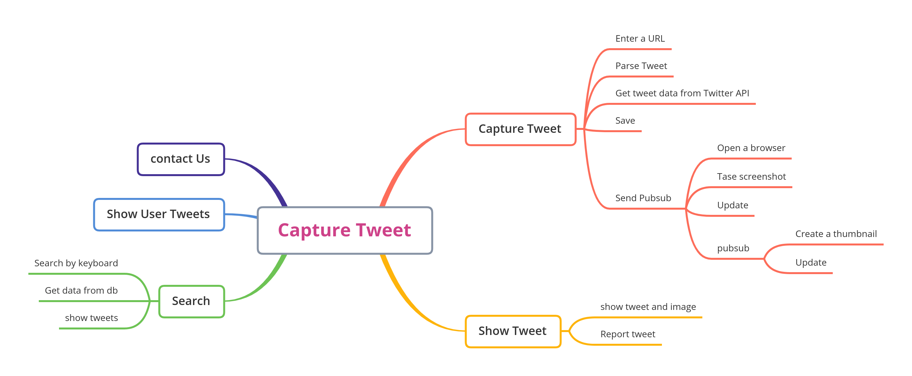

# CaptureTweet

[](https://github.com/rayyildiz/capture-tweet/actions/workflows/ci.yml)
[](https://github.com/rayyildiz/capture-tweet/actions/workflows/pr.yml)
[](https://github.com/rayyildiz/capture-tweet/actions/workflows/security_scan.yml)

CaptureTweet is a small self-hostable service that captures a Tweet as an image, stores metadata, and exposes a GraphQL API for searching and retrieving Tweets and authors. The project was originally built to experiment with Google Cloud Run.

Note: The hosted instance was shut down on 2023‑12‑31 due to Twitter API pricing changes. You can still self‑host using the instructions below.

## Overview

- Backend: Go + gqlgen GraphQL API
- Storage: Go Cloud Docstore (Firestore or in‑memory for dev)
- Search: Algolia
- Pub/Sub: Go Cloud Pub/Sub (GCP Pub/Sub or in‑memory for dev)
- Blob: Go Cloud Blob (GCS, file, or in‑memory)



## Quick Start (Local)

1. Prerequisites
   - Go (latest stable)
   - Algolia application (you can use placeholder values to boot the server)
2. Copy .env and adjust if needed (defaults are present in the repo).
3. Run the API server:
   - go run ./cmd/server
4. Open GraphQL Playground (if enabled):
   - http://localhost:4000/api/docs
   - GraphQL endpoint: http://localhost:4000/api/query

Tip: To start without external services, use in‑memory URIs for Docstore, Pub/Sub and Blob. Algolia env vars must be non‑empty for the server to start (fake strings work for booting).

## Configuration

The server reads environment variables (from your shell and .env). Common setups:

- Minimal in‑memory/dev configuration

```dotenv
# Docstore (in‑memory)
DOCSTORE_TWEETS=mem://tweet/id
DOCSTORE_USERS=mem://users/id
DOCSTORE_CONTACT_US=mem://contact/id

# Pub/Sub (in‑memory)
TOPIC_CAPTURE=mem://captureRequest

# Blob (local filesystem or in‑memory)
BLOB_BUCKET=file:///tmp/capture
# BLOB_BUCKET=mem://bucket

# GraphQL
GRAPHQL_ENABLE_PLAYGROUND=true
PORT=4000

# Twitter API (required for capture to work)
TWITTER_ACCESS_SECRET=
TWITTER_ACCESS_TOKEN=
TWITTER_CONSUMER_KEY=
TWITTER_CONSUMER_SECRET=

# Algolia (required to start the server; fake strings are OK for local boot)
ALGOLIA_SECRET=your_secret
ALGOLIA_CLIENT_ID=your_client_id
ALGOLIA_INDEX=tweets-LOCAL
```

- Firestore (local emulator) example

If you prefer Firestore via Go Cloud Docstore:

```dotenv
FIRESTORE_EMULATOR_HOST=localhost:8080
DOCSTORE_TWEETS=firestore://projects/local/databases/(default)/documents/dev-tweets?name_field=id
DOCSTORE_USERS=firestore://projects/local/databases/(default)/documents/dev-authors?name_field=id
DOCSTORE_CONTACT_US=firestore://projects/local/databases/(default)/documents/dev-contact?name_field=id
```

Note: MongoDB settings previously listed were removed since this codebase currently registers Firestore and in‑memory Docstore drivers. There is no MONGO_SERVER_URL usage in the code.

## API

- Playground (when GRAPHQL_ENABLE_PLAYGROUND=true): GET /api/docs
- Endpoint: ANY /api/query
- Schema: see schema.graphql

Example operations:
- Query a tweet by ID: query { tweet(id: "123") { id fullText author { userName } } }
- Search: query { search(input: { term: "golang" }, size: 10) { id fullText } }
- Capture: mutation { capture(url: "https://twitter.com/.../status/123") { id captureURL } }

## Run with Docker

- Build and run locally without pushing:
  - make generate
  - CGO_ENABLED=0 GOOS=linux GOARCH=amd64 go build -o cmd/server/tmp/app cmd/server/main.go
  - docker build -t capturetweet-server:local cmd/server
  - docker run -p 4000:4000 --env-file .env capturetweet-server:local

The provided Makefile also includes a docker-backend target that builds and pushes to an example registry; update it to your registry if needed.

## Development

- Run tests: go test ./...
- Code generation (gqlgen mocks, etc.): make generate

## Tutorial

- [Golang Tutorial](./golang.md)

## RoadMap

- [x] Create a skeleton project
- [x] Add GraphQL support
- [x] Tweet Service
  - [x] CRUD for tweet service
  - [x] Use Algolia for search
  - [x] Store user additional data in a different collection
- [x] Async capture
  - [x] Pub/Sub support
  - [x] Capture and update collection
- [x] New UI design
- [x] Apollo client support
- [x] Capture tweet
  - [ ] Real time image update with Firebase JS
  - [ ] GraphQL subscribe
  - [x] Report capture
- [x] Search tweet
- [x] Contact us

## License

This project is licensed under the MIT License – see the LICENSE file for details.
